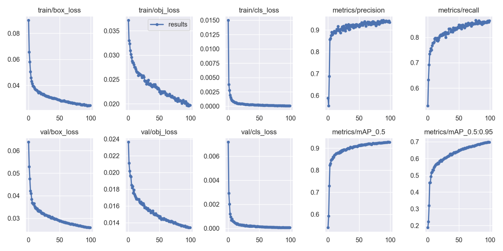
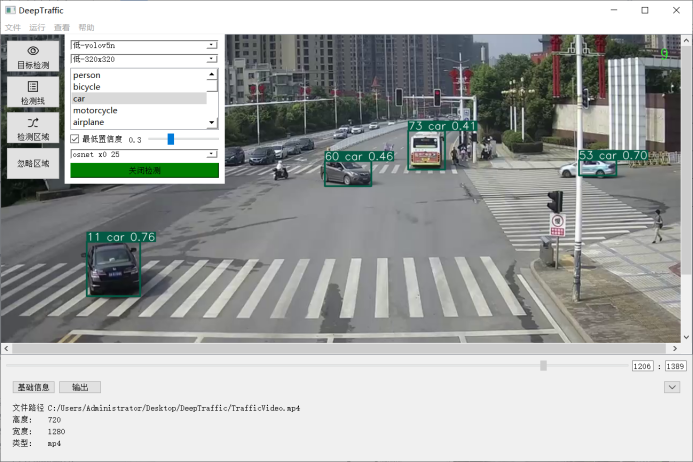
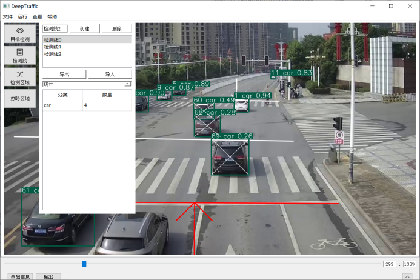
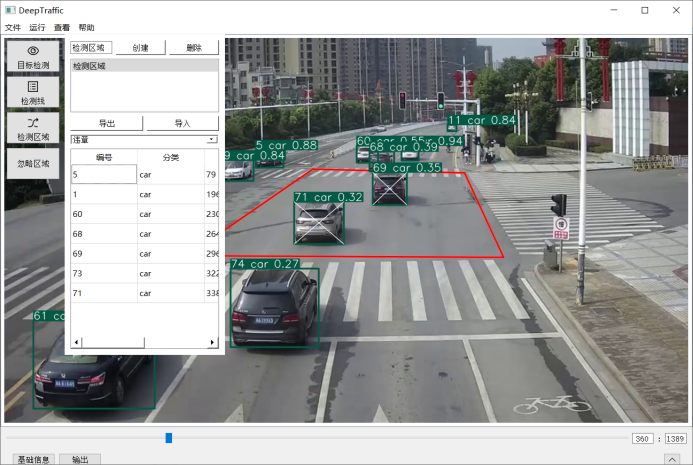
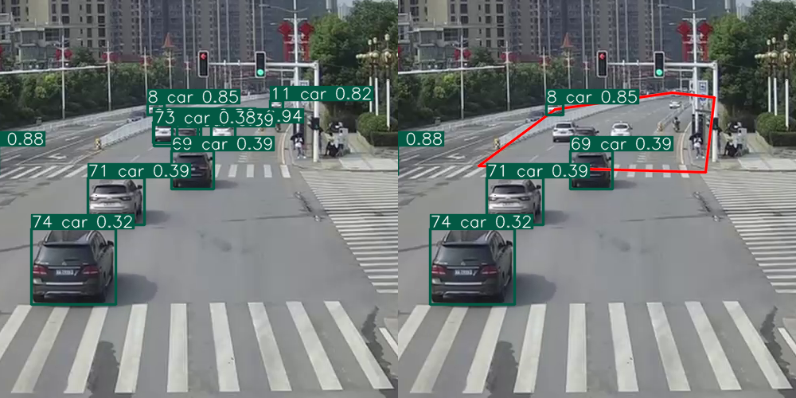

## 前言

毕业设计：基于深度学习的交通流视频检测系统

## 模型训练

模型训练的数据选择是3000张UA-DETRAC的道路监控图片和2000张COCO2012中人相关的图片，其中训练集3000张，验证集1000张，测试集1000张。

| 名称 | 详细 |
| :-- | :-- |
| names（分类） | car（车辆），person（行人） |
| epochs（训练轮数） | 100（轮） |
| batch size（单次取样） | 8（张） |
| img size（输入尺寸） | 320x320（像素） |
| weights（初始权重） | yolov5s.pt |

在使用GTX 1650 4G显卡进行CUDA加速的情况下，100轮训练总耗时为12小时，训练过程中模型在验证集上的表现如图4-3所示。最终模型在验证集和测试集上对车辆目标的检测精度分别达到95.5%和93.2%，对行人目标的检测精度分别达到89.1%和86.2%。

## 软件设计

### 目标检测

### 检测线

### 检测区域

### 忽略区域

## 参考项目

[ultralytics/yolov5](https://github.com/ultralytics/yolov5)
[heartexlabs/labelImg](https://github.com/heartexlabs/labelImg)
[HowieMa/DeepSORT_YOLOv5_Pytorch](https://github.com/HowieMa/DeepSORT_YOLOv5_Pytorch)